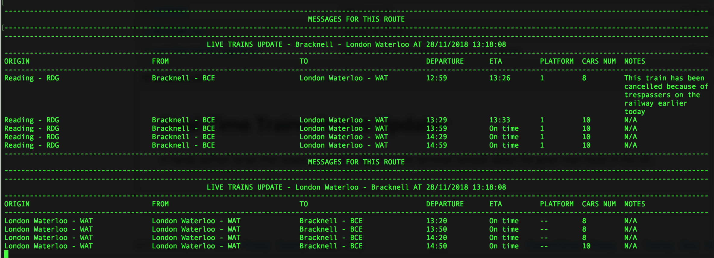

# Real-Time Trains Status Updater 

A handy python script that outputs real-time data into the terminal console about the given train route in the UK. 

In order to use the script, a security token needs to be generated and supplied via `--token` parameter. The registration can be made via National Rail service at http://www.nationalrail.co.uk/100296.aspx free of charge. Select the `Register here` link for LDB Webservice (PV) SOAP API Feed Type from the table. 

<h3>Parameters:</h3> 
 
`--refresh-rate`: how often the timetable should update in seconds (default = 30) 
`--token`: The security token provided by National Rail Services (format = xxxxxxxx-xxxx-xxxx-xxxx-xxxxxxxxxxxx) 
`--origin`: The starting location of the journey. It needs to be provided in CRS 3-letter code for a station. The list of all available CRS codes can be found at http://www.nationalrail.co.uk/stations_destinations/48541.aspx (default = RDG) 
`--destination`: The destination location of the journey. It needs to be provided in CRS 3-letter code for a station. The list of all available CRS codes can be found at http://www.nationalrail.co.uk/stations_destinations/48541.aspx (default = WAT) 
`--rows`: The maximum number of rows to be returned from API and output in the timetable (default = 4) 
`--add-return`: Additional timetable that will show return services for the journey at present time 

<h3>Additional Notes:</h3> 

Tested with `Python 3.7.1`
The script relies on `requests` python module. The installation instructions can be found here: http://docs.python-requests.org/en/master/user/install/ 

<h3>Example:</h3> 

`./real-time-trains-updater.py --origin BCE --destination WAT --rows 5 --add-return --token xxxxxxxx-xxxx-xxxx-xxxx-xxxxxxxxxxxx` 
where `xxxxxxxx-xxxx-xxxx-xxxx-xxxxxxxxxxxx` is your generated token.
